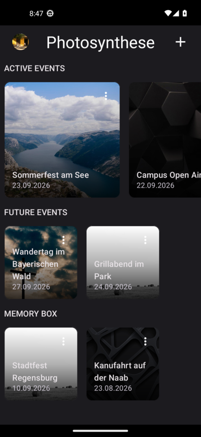
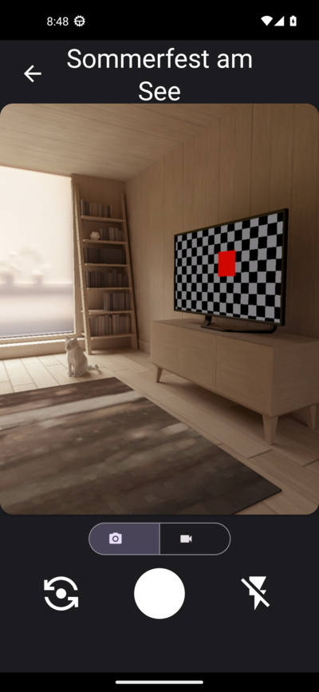
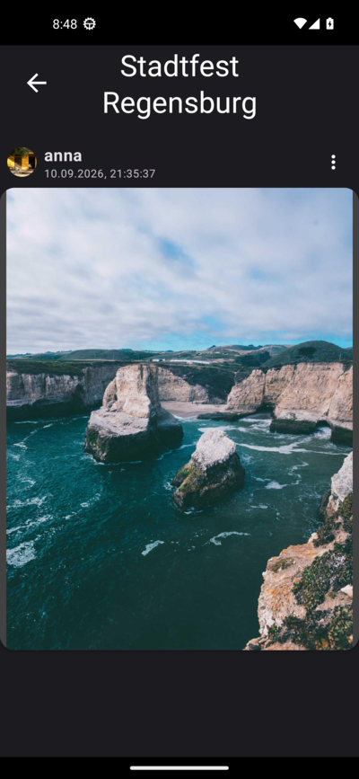

# Photosynthese

Photosynthese is an Android app for sharing photos and videos with friends at events. Create an
event, invite friends with its ID and capture memories together in a shared gallery.

## Screenshots

| Events | Camera | Memory box |
| --- | --- | --- |
|  |  |  |

## Features

- Create events and invite friends with a shareable event ID
- Organize events as active, upcoming or memories
- Capture and share photos and videos during an event
- Browse and download shared media after an event
- Manage event schedules and your user profile

## Tech stack

- Kotlin and Android SDK 33
- AndroidX, Material 3 and CameraX
- Firebase Authentication, Cloud Firestore and Cloud Storage
- Glide, LiveData and coroutines

## Getting started

Requirements: JDK 17, Android SDK 33 and a Firebase project.

1. Create a project in the [Firebase Console](https://console.firebase.google.com)
2. Enable email/password authentication, Firestore and Storage
3. Register an Android app with the package name `com.othregensburg.photosynthese`
4. Download `google-services.json` and place it in `app/`

```sh
./gradlew assembleDebug
./gradlew installDebug
```

Alternatively, open the project in Android Studio and run it on a device or emulator.
